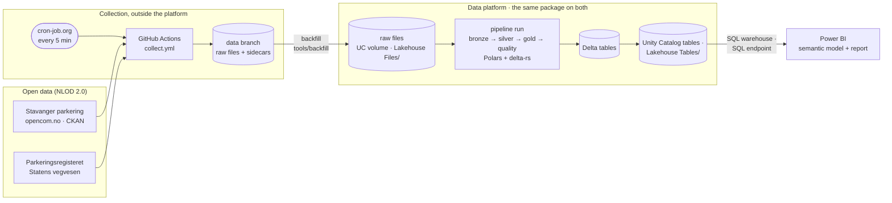
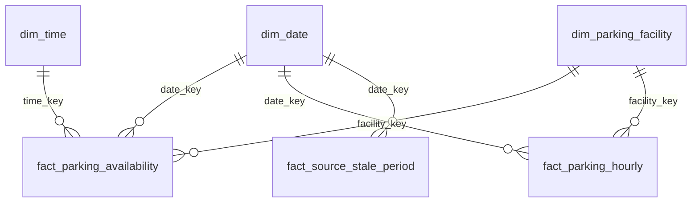

# Stavanger Parking

Case solution: collection, transformation and modelling of open parking data from Stavanger kommune ([opencom.no/dataset/stavanger-parkering](https://opencom.no/dataset/stavanger-parkering)) with a medallion architecture (bronze → silver → gold), a star schema and a Power BI report. One repository deploys to Microsoft Fabric and to Databricks ([ADR 011](docs/adr/011-one-repository-two-platforms.md)).

For the 22 October meeting, the [walkthrough](docs/walkthrough.md) goes through the case requirements in 15 minutes. Work is planned and tracked in [GitHub Issues](https://github.com/VirtueMe/stavangerparking/issues) and on the project board [The Stavanger Parking Case](https://github.com/users/VirtueMe/projects/3). The [initial plan](https://github.com/VirtueMe/stavangerparking/blob/27c5e3337b7e2341de13154f83ac222038971b3e/backlog.md) the issues were created from is kept in the history.

## Status

As of 1 October 2026:

- **Collection** runs every 5 minutes on GitHub Actions, started by cron-job.org, onto the [`data` branch](https://github.com/VirtueMe/stavangerparking/tree/data): the parking feed adaptively, the national parking register hourly ([collector](docs/collector.md), [ADR 007](docs/adr/007-collect-outside-the-platform.md), [ADR 008](docs/adr/008-trigger-collection-externally.md)).
- **Databricks** (Free Edition) runs the pipeline from this repository as an Asset Bundle, with the released wheel: bronze, silver, gold and the quality checks, then the report's tables published to Unity Catalog ([`docs/databricks.md`](docs/databricks.md)). Its data comes from the `data` branch by backfill; its own collector is deployed but paused.
- **Power BI**: the semantic model and report are published from the repository to a Pro workspace and refresh from Databricks through a SQL warehouse ([`docs/report.md`](docs/report.md#on-a-platform)). Its five pages (availability, patterns, map, data freshness and quality, about) have their visuals (#87, #89); a [screenshot of the freshness page from 1 October 2026](docs/report.md#pages) shows it to readers without access.
- **Fabric** is ready to deploy but not deployed: the Lakehouse, notebooks and pipeline are in [`platforms/fabric/`](platforms/fabric/), and the same tools deploy them, but it needs a capacity, which the own tenant cannot get (#16, [`docs/fabric.md`](docs/fabric.md)).
- **The source feed can freeze without notice.** From 23 September 2026, 19:16 to 1 October 2026, 13:50 it repeated one reading while the file was re-published every 2 minutes, and it recovered without anyone reporting it. Everything downstream shows stale data as stale rather than hiding it ([known weaknesses](#known-weaknesses)).

## Architecture



- **The raw files are the source of truth.** Every snapshot is stored as fetched, next to a sidecar that says when and how it was fetched. Every table can be rebuilt from them, on any platform.
- **Collection stays outside the platform** until one takes over, with a handover that keeps a single collector of record, so every period of history has exactly one ([ADR 011](docs/adr/011-one-repository-two-platforms.md#collection-one-collector-of-record-and-a-handover)).
- **One package, thin platforms.** The logic is the `stavanger_parking` package ([`src/`](src/stavanger_parking/)), on Polars and delta-rs rather than Spark ([ADR 001](docs/adr/001-polars-over-pyspark.md)), tested locally and in CI; it imports nothing platform-specific. `platforms/<platform>/` holds only what differs: where storage is, how runs are scheduled, how Power BI connects. `tools/deploy`, `tools/backfill` and `tools/report` run the same operations on either platform; `tools/rebuild` is Databricks only until Fabric has run (#16).

[`docs/architecture.md`](docs/architecture.md) has the full design: each layer's tables and grain, the star schema's columns, and the platform mapping.

### Data flow

1. **Collect.** Adaptive polling fetches the parking feed every 5 minutes while its values change and every 20 while they do not ([ADR 003](docs/adr/003-polling-interval.md)); the register is fetched hourly and filtered to the mapped areas ([ADR 010](docs/adr/010-collect-the-register-hourly.md)). The download URL is resolved through CKAN on every run.
2. **Bronze** loads each raw file once, all fields as text with the sidecar's metadata, append-only; unreadable files are recorded, not dropped ([`docs/bronze.md`](docs/bronze.md)).
3. **Silver** types the values, converts Oslo time to UTC, deduplicates repeated fetches into readings, quarantines values it cannot parse, and detects when the source has gone stale ([`docs/silver.md`](docs/silver.md), [ADR 009](docs/adr/009-silver-model.md)).
4. **Gold** maintains the dimensions and builds the facts ([`docs/gold.md`](docs/gold.md)), and suggests prices from occupancy ([`docs/pricing.md`](docs/pricing.md)).
5. **Quality** checks the latest snapshot and the model; a critical failure stops the run with exit code 3 and every result is stored ([`docs/quality.md`](docs/quality.md)).
6. **Report.** Power BI imports the star schema from the platform ([`docs/report.md`](docs/report.md)).

One entry point runs steps 2 to 5 on any platform: `python -m stavanger_parking.pipeline run --raw-root … --tables-root …` ([`docs/pipeline.md`](docs/pipeline.md)).

### Star schema



- **`fact_parking_availability`**: a periodic snapshot, one row per facility per source reading, valid until the facility's next reading. Collection is irregular, so averages over time are weighted by duration; free spaces add up across facilities at one moment, never across time.
- **`fact_parking_hourly`**: per facility and hour, the time-weighted average, minimum and maximum, how much of the hour the readings cover and how much of it was stale.
- **`fact_source_stale_period`**: one row per stale period of the source, with its start, end and length; the end is blank while the period is ongoing.
- **`dim_parking_facility`**: the facility name is the natural key ([ADR 004](docs/adr/004-facility-name-as-natural-key.md)); capacity comes from the national parking register through a mapping file ([ADR 005](docs/adr/005-capacity-as-reference-data.md)). **`dim_date`** has Norwegian public holidays; **`dim_time`** has one row per minute with 15-minute buckets.

### A new facility

Nothing to do in code or configuration. A new facility appears in the next snapshot, flows through bronze and silver, and the facility MERGE gives it a new key and `first_seen` (tested with a synthetic tenth facility). It has **no capacity until it is added to the [facility mapping](docs/config.md#facility-mapping)**, one line; until then the quality check stops the run, deliberately, so an unmapped facility cannot go unnoticed. A facility that disappears is marked inactive, never deleted; a renamed one appears as new ([ADR 004](docs/adr/004-facility-name-as-natural-key.md)).

### Rebuilding

Bronze loads only the raw files it does not have, and silver derives its readings from all fetches on every run, so incremental runs give the same tables as a rebuild (the tests check it). To rebuild everything, run the pipeline on the raw files into an empty tables root:

```sh
uv run python -m stavanger_parking.pipeline run --raw-root <data branch checkout> --tables-root <empty folder>
```

To rebuild only silver from bronze, after a change to parsing or deduplication: `uv run python -m stavanger_parking.silver.build --tables-root <tables> --rebuild`. On Databricks, `tools/backfill -p databricks` copies the raw files into the volume and runs the pipeline job, and `tools/rebuild -p databricks` runs it with silver rebuilt from bronze.

### How it scales

From the scalability assessment ([ADR 006](docs/adr/006-scalability-assessment.md), measured with [`benchmarks/scaling.py`](benchmarks/scaling.py)):

| Grows | What carries it | Where it stops |
|---|---|---|
| **Facilities** | No code or configuration change; one mapping line each for capacity | Memory, as for history |
| **History** | Incremental loads; a year of the feed is about a second and 1 GB for the whole derivation | Silver derives from all fetches every run: about 13 GB at 19 million fetch rows. Derive only the affected dates, or move to Spark, before the fetch table nears 20 million rows (20 years of this feed) |
| **Sources and municipalities** | Declarative configuration: collection, bronze, maintenance and the quality framework take a new source as a config entry | The model is written for one parking source; a second needs a field mapping and the source in the facility key |
| **Polling frequency** | Linear in runs and rows | Every run derives from all history, so faster polling multiplies the daily work |

## Known weaknesses

The full log is [`docs/weaknesses.md`](docs/weaknesses.md), kept as trade-offs are made. The ones that matter most:

| Weakness | Mitigation |
|---|---|
| **The feed can freeze without notice**, while every "updated" signal (dataset page, CKAN, HTTP headers, ETag) moves with each re-upload. It was frozen from 23 September to 1 October 2026 and recovered on its own, with no notice from the provider either way. The source only has the current state, so a gap in collection is lost for good | Freshness is judged from the data's own timestamp, never from metadata; stale periods are stored and shown in the facts and the report; the owner has no support channel beyond `opendata@stavanger.kommune.no` ([ADR 003](docs/adr/003-polling-interval.md), [ADR 007](docs/adr/007-collect-outside-the-platform.md)) |
| **Collection depends on cron-job.org** because GitHub's own schedule started 2 of about 145 runs; nothing alerts if the calls stop | Gaps are listed from the sidecars (`collect gaps`); the raw files let everything downstream be rebuilt; a platform takes over collection at the handover ([ADR 008](docs/adr/008-trigger-collection-externally.md), [ADR 011](docs/adr/011-one-repository-two-platforms.md)) |
| **Capacity comes from the national register through a hand-maintained mapping, and the register can be wrong**: Forum reports 292 free spaces against a capacity of 289 | Occupancy can be negative and is shown, not hidden; the quality check stops the run on it, on purpose ([ADR 005](docs/adr/005-capacity-as-reference-data.md)) |
| **The facility name is the natural key**; the feed has no id | A rename splits a facility's history; the old name is kept inactive and can be mapped ([ADR 004](docs/adr/004-facility-name-as-natural-key.md)) |
| **Polars on one node** holds all fetches in memory during the derivation | Fine for decades of this feed; derive by date window or switch to Spark near 20 million fetch rows; the Delta tables are engine-neutral ([ADR 001](docs/adr/001-polars-over-pyspark.md), [ADR 006](docs/adr/006-scalability-assessment.md)) |
| **On Databricks, delta-rs cannot commit to a volume safely** and uses a plain rename | Safe with one writer: the pipeline job allows one run at a time, and anything else that writes the tables must be a task of that job ([`docs/databricks.md`](docs/databricks.md)) |
| **Databricks does not collect yet.** Its collection job works on Free Edition (tested on 2026-10-02, after the outbound restriction was lifted), but stays paused: collection has one collector of record until a handover | Databricks gets its data by backfill from the `data` branch; GitHub Actions stays the collector of record until the handover in [ADR 011](docs/adr/011-one-repository-two-platforms.md#collection-one-collector-of-record-and-a-handover) |
| **The report's Fabric data source has not been tried** | The model and its five pages refresh on Databricks and every measure evaluates in the service; the Fabric source is checked when Fabric is deployed ([`docs/report.md`](docs/report.md), #16) |

## Getting started

Requires [uv](https://docs.astral.sh/uv/). From a fresh clone:

```sh
uv run pytest
```

This installs the pinned Python version and dependencies into `.venv` and runs the test suite. See [`CONTRIBUTING.md`](CONTRIBUTING.md) for the development workflow.

## Deploying

Every platform is deployed with the same three commands in [`tools/`](tools/), which run that platform's scripts in `platforms/<platform>/`. They work on **dev** by default; `--prod` targets production, and `--dry-run` (`-n`) shows what would happen without changing anything. On every platform the dependencies are installed at the versions in `uv.lock`, the release's own for prod, so what runs is what CI tested ([ADR 012](docs/adr/012-uv-lock-everywhere.md)).

### Databricks

Needs the [Databricks CLI](https://docs.databricks.com/aws/en/dev-tools/cli/install), [uv](https://docs.astral.sh/uv/) and the [GitHub CLI](https://cli.github.com/). Once:

```sh
databricks auth login --host https://<workspace>.cloud.databricks.com   # the workspace stays out of the repository
uv run --only-group powerbi fab auth login                              # the Fabric CLI, for publishing the report
echo PLATFORM=databricks >> .env                                        # or pass -p databricks to every command
```

Then:

```sh
tools/deploy --prod --dry-run   # the plan, and the release it would install
tools/deploy --prod             # the bundle, with the latest release's wheel (or give a tag, to revert)
tools/backfill --prod           # copy the raw files from the data branch, and run the pipeline
tools/rebuild --prod            # after a parsing change: run the pipeline with silver rebuilt from bronze
tools/report --prod             # publish the Power BI model and report; set the credentials once in the service
```

Without `--prod`, `tools/deploy` builds the wheel from your checkout and deploys a dev copy, with every schedule paused. The details: [`docs/databricks.md`](docs/databricks.md) for the bundle, its jobs and backfill, and [`docs/report.md`](docs/report.md#on-a-platform) for the report.

### Fabric

The same commands with `-p fabric`. The items and scripts are ready, but not yet run: they need a Fabric capacity, which is pending (#16). Needs the Fabric CLI, signed in (above), and the workspace names:

```sh
export FABRIC_WORKSPACE="<prod workspace>"   # and FABRIC_DEV_WORKSPACE for dev
tools/deploy -p fabric --prod --dry-run      # prepare the items and check the workspace
tools/deploy -p fabric --prod                # the Lakehouse, the notebooks and the pipeline, with fabric-cicd
tools/backfill -p fabric --prod              # copy the raw files into the Lakehouse, and run the pipeline
tools/report -p fabric --prod                # the report, on the Lakehouse's SQL endpoint
```

The details, and what has not been tried: [`docs/fabric.md`](docs/fabric.md).

## Repository layout

| Path | Contents |
|---|---|
| `src/stavanger_parking/config/sources.json` | [Source configuration](docs/config.md): where each dataset comes from, where it lands, and its licence |
| `src/stavanger_parking/` | Transformation logic as plain Python modules; notebooks import from here |
| `tests/` | Tests, run on every pull request |
| `benchmarks/scaling.py` | How the transformations scale with facilities and years ([ADR 006](docs/adr/006-scalability-assessment.md)) |
| `.github/workflows/collect.yml` | [Collector](docs/collector.md): snapshot collection of the parking feed and the parking register onto the `data` branch, started by cron-job.org |
| `src/stavanger_parking/config/facility_mapping.json` | [Facility mapping](docs/config.md#facility-mapping): feed names to their areas in the national parking register |
| `docs/pipeline.md` | [Pipeline](docs/pipeline.md): the one entry point that runs every layer, its parameters and exit codes |
| `platforms/databricks/` | [Databricks deployment](docs/databricks.md): the Asset Bundle, its jobs, deploying and backfilling |
| `platforms/fabric/` | [Fabric deployment](docs/fabric.md): the Lakehouse, notebooks and pipeline as files, deployed with fabric-cicd; ready, not yet run |
| `tools/` | `deploy`, `backfill` and `report` for any platform: `tools/deploy -p databricks [--prod] [--dry-run]`, or with `PLATFORM` in `.env` ([deploying](docs/databricks.md#deploying), [the report per platform](docs/report.md#on-a-platform)) |
| `docs/bronze.md` | [Bronze loading](docs/bronze.md): raw files into the bronze Delta table |
| `docs/silver.md` | [Silver](docs/silver.md): typed readings and quarantined values |
| `docs/gold.md` | [Gold](docs/gold.md): the star schema's dimensions and facts |
| `powerbi/` | [Power BI project](docs/report.md): the semantic model as TMDL and the report pages |
| `docs/price-boards.md` | [Price boards](docs/price-boards.md): requirements for showing a dynamic price at the entrance (discussion only) |
| `docs/pricing.md` | [Suggested prices](docs/pricing.md): tariffs, pricing rules and `fact_suggested_price` |
| `docs/maintenance.md` | [Table maintenance](docs/maintenance.md): compacting and vacuuming the Delta tables |
| `docs/quality.md` | [Data quality checks](docs/quality.md): what is checked, what stops a run, and the stored results |
| `docs/architecture.md` | [Architecture](docs/architecture.md): data flow, layers and star schema |
| `docs/walkthrough.md` | [Walkthrough](docs/walkthrough.md) for the 22 October meeting: what to show and say for each case requirement, and likely questions |
| `docs/adr/` | [Architecture decision records](docs/adr/README.md) |
| `docs/weaknesses.md` | [Known weaknesses](docs/weaknesses.md), recorded as they appear |
| `templates/DATA-LICENCE.md` | Data attribution placed at the root of the `data` branch |

## Data sources and licence

Both sources are open data under the [Norwegian Licence for Open Government Data (NLOD) 2.0](https://data.norge.no/nlod/en/2.0):

- [Stavanger parkering](https://opencom.no/dataset/stavanger-parkering), published by **Stavanger kommune**: free spaces per facility.
- [Parkeringsregisteret](https://data.norge.no/en/datasets/a0cf9785-601e-4c5b-b19c-74b639b5819a/parkeringsregisteret), published by **Statens vegvesen**: the facilities' capacities.

Raw snapshots are republished unchanged on the [`data` branch](https://github.com/VirtueMe/stavangerparking/tree/data) (the register filtered to the mapped areas), and derived tables and reports are built from them.

> Contains data under the Norwegian licence for Open Government data (NLOD) distributed by Stavanger kommune.
>
> Contains data under the Norwegian licence for Open Government data (NLOD) distributed by Statens vegvesen.

Each source's licence is recorded in [`src/stavanger_parking/config/sources.json`](src/stavanger_parking/config/sources.json), so a source cannot be added without one.

## Licence

The code in this repository is licensed under the [MIT licence](LICENSE). The data is not covered by it; it remains under NLOD 2.0 as described above.
