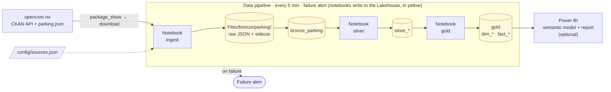
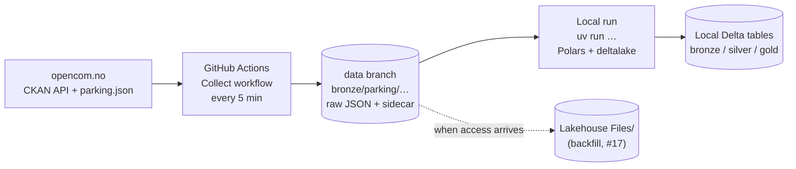
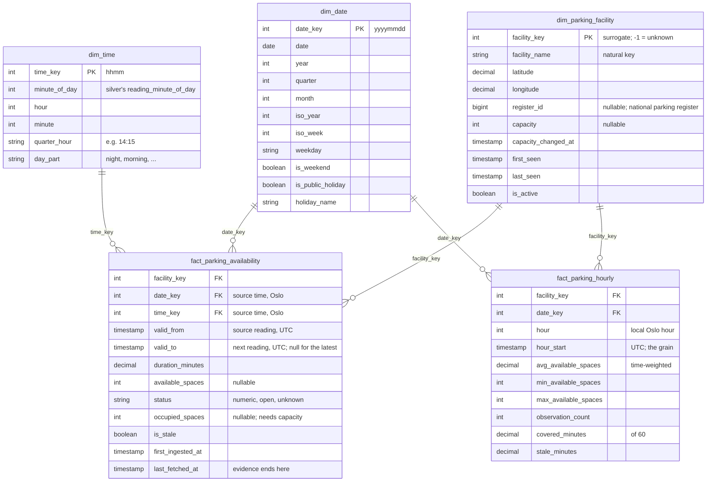

# Architecture

How open parking data from Stavanger flows from the source to a star schema, following the medallion structure (bronze → silver → gold). This is the working design: later issues that change it update this document.

## At a glance

- **Source:** the CKAN dataset [Stavanger parkering](https://opencom.no/dataset/stavanger-parkering) (Stavanger kommune, [NLOD 2.0](https://data.norge.no/nlod/en/2.0)): the current number of free spaces in 9 parking facilities, re-published every 2 minutes. Only the current state is available, so history exists only if we collect it.
- **Collection:** adaptive polling, every 5 minutes while the values change and every 20 minutes while they don't ([ADR 003](adr/003-polling-interval.md)). The download URL is resolved through the CKAN API on every run.
- **Storage:** raw responses are kept unchanged and are the source of truth; every table can be rebuilt from them.
- **Engine:** Polars and delta-rs on pure Python notebooks, not Spark ([ADR 001](adr/001-polars-over-pyspark.md)). The logic lives in the `stavanger_parking` package; notebooks are thin wrappers, so the same code runs and is tested locally.
- **Model:** a periodic snapshot fact of availability per facility and reading, an hourly aggregate fact, and date, time and facility dimensions.

## Target data flow (Microsoft Fabric)

The notebooks (rectangles) run in one Data pipeline; the yellow cylinders are the Lakehouse: raw files in `Files/`, Delta tables in `Tables/`.

| Step | Fabric item | What it does | Issue |
|---|---|---|---|
| Orchestration | Data pipeline | Scheduled every 5 minutes; runs ingest → silver → gold with dependencies, parameters from the config, and an alert when a step fails | #18, #19 |
| Ingest | Notebook (Python) | Decides whether to fetch (adaptive polling), resolves the resource through CKAN, stores the raw response and sidecar in `Files/`, appends to `bronze_parking` | #4, #6, #7, #18 |
| Silver | Notebook (Python) | Types, deduplicates, quarantines unparseable values, flags staleness | #8, #9, #10 |
| Gold | Notebook (Python) | Maintains the dimensions (MERGE) and builds the facts | #11–#14 |
| Storage | Lakehouse | `Files/` for raw files, `Tables/` for Delta tables of every layer | #16 |
| Maintenance | Data pipeline + notebook | `OPTIMIZE` and `VACUUM` against small-file growth | #20 |
| Quality | Notebook step | Data quality and schema drift checks; a critical failure stops the pipeline | #21 |
| Reporting | Semantic model + report | On the gold tables (optional) | #24 |

## Interim flow (until platform access)

A Fabric trial could not be activated, so collection started outside the platform ([ADR 007](adr/007-collect-outside-the-platform.md)). The raw files are stored in the same layout the Lakehouse will use, and are copied there when access is available (#17).

See [`docs/collector.md`](collector.md) for how a collection run works.

## Layers

| Layer | Object | Grain | Contents |
|---|---|---|---|
| Raw (bronze) | `Files/bronze/parking/yyyy/mm/dd/HHmmss.json` | One file per fetched snapshot | The response byte for byte, plus a sidecar (`.meta.json`) with `ingested_at`, source, run, `content_hash`, `values_fingerprint`, polling mode and next due time |
| Bronze | `bronze_parking` | One row per record per fetched snapshot | All source fields as strings, plus the sidecar metadata (`ingested_at`, `source_url`, `content_hash`, `values_fingerprint`, `run_id`, …) and `raw_file` + `record_index`. Append-only, loaded once per raw file ([`docs/bronze.md`](bronze.md)) |
| Bronze | `bronze_parking_load_issues` | One row per raw file that cannot be loaded | Missing or unreadable sidecar, unreadable or empty payload, with the reason |
| Silver | `silver_parking_fetch` | One row per facility per fetch | Every typed bronze row; how often a reading was fetched |
| Silver | `silver_parking_reading` | One row per facility per source reading | Typed ([`docs/silver.md`](silver.md)): timestamp in UTC with the Oslo local date, minute of day and UTC offset, coordinates as decimals, `available_spaces` as a nullable integer and `status` (`numeric`, `open`, `unknown`). Deduplicated on (facility, source timestamp) |
| Silver | `silver_snapshot_freshness` | One row per fetched snapshot | Source timestamp vs. `ingested_at`, and whether the source was stale at that fetch ([`docs/silver.md`](silver.md#source-staleness)) |
| Silver | `silver_parking_area` | One row per register area per register snapshot | Capacities from the national parking register, typed ([`docs/silver.md`](silver.md#silver_parking_area)) |
| Silver | `silver_stale_period` | One row per stale period | The frozen source timestamp, from when it was too old until the last fetch that saw it |
| Silver | `silver_quarantine` | One row per rejected value | The raw value, the field and the reason; nothing is dropped silently |
| Gold | dimensions and facts | See below | The star schema |

Silver can always be rebuilt from bronze, and bronze from the raw files, with the same result as incremental runs (#9).

## Star schema (draft)

### Facts

- **`fact_parking_availability`** is a periodic snapshot fact at the grain of **one row per facility per source reading**. Repeated fetches of the same reading, such as during an outage, collapse into one row; how often we fetched stays in silver.
  - Each reading is valid from its source timestamp until the facility's next reading (`valid_from`, `valid_to`, `duration_minutes`). Collection is adaptive and therefore irregular ([ADR 003](adr/003-polling-interval.md)), so any average over time must be **time-weighted** by duration, not a plain average of rows.
  - Date and time keys come from the **source's** timestamp in Oslo time: the analysis is about when the parking situation occurred, not when we fetched it.
  - **`available_spaces` is semi-additive:** it can be summed across facilities at one point in time (free spaces in the city centre right now), but not across time. Across time, use time-weighted averages, minimum and maximum.
  - `status = open` (the source reports `"Open"` instead of a number) and `unknown` keep `available_spaces` null rather than inventing a value.
- **`fact_parking_hourly`** aggregates per facility per hour: time-weighted average, minimum, maximum, the number of readings, `covered_minutes` (how much of the hour the readings cover) and `stale_minutes` (how much of it rests on stale data). Low coverage or high staleness is visible instead of hidden in an average.

### Dimensions

- **`dim_date`**: one row per day from 2020 to 2035, with ISO week, weekday, weekend and Norwegian public holidays ([`docs/gold.md`](gold.md#dim_date)).
- **`dim_time`**: one row per minute of the day, with a 15-minute bucket and part of day ([`docs/gold.md`](gold.md#dim_time)).
- **`dim_parking_facility`**: one row per facility, maintained with MERGE (#12). The facility name is the natural key (ADR 004). Capacity comes from the national parking register (Parkeringsregisteret), collected hourly (ADR 010) and linked to the feed's names by a hand-maintained mapping file, and may be unknown (ADR 005). Attributes are overwritten (type 1); `first_seen`, `last_seen` and `is_active` record the facility's lifetime in the feed. The unknown member (`-1`) catches facts whose facility cannot be resolved, so no fact row is lost.

## Configuration, new sources and new facilities

- **Configuration** lives in [`config/sources.json`](../config/sources.json): per source, the CKAN location, the raw path template, the bronze table, the licence and the polling parameters ([`docs/config.md`](config.md)). Paths and table names are relative; the storage root and schema belong to the runtime, so the same config works locally and on the platform.
- **A new source** is a new config entry; no code changes. The collector, bronze loading and the tests pick it up.
- **A new facility** needs nothing at all. It appears in the next snapshot, flows through bronze and silver unchanged, and the facility MERGE inserts it into `dim_parking_facility` with a new surrogate key and `first_seen` (tested with a synthetic 10th facility in #12). Its capacity is unknown until it is added to the mapping file.
- **A facility that disappears** from the feed is marked `is_active = false`, never deleted, so its history keeps its dimension row.
- **A renamed facility** would appear as a new facility, because the name is the natural key: a known weakness, discussed in ADR 004 (#15).

## Platform mapping

The platform is not final: if Fabric access is not available, the case moves to Databricks, which was offered as an equal alternative. The design is the same; only the items change.

| Concern | Microsoft Fabric | Databricks |
|---|---|---|
| Raw files | Lakehouse `Files/` | Unity Catalog volume |
| Tables | Lakehouse `Tables/` (Delta) | Unity Catalog schemas (Delta) |
| Transformations | Notebooks (pure Python) | Notebooks (serverless) |
| Orchestration and alerts | Data pipeline | Lakeflow Jobs |
| Deployment | Git integration | Databricks Asset Bundles |
| Reporting | Power BI semantic model | Power BI via SQL warehouse, or AI/BI dashboards |

On Databricks, the engine choice would be revisited ([ADR 001](adr/001-polars-over-pyspark.md)), since its managed features assume Spark.

## Related documents

- Decisions: [`docs/adr/`](adr/README.md)
- Known weaknesses: [`docs/weaknesses.md`](weaknesses.md)
- Source configuration: [`docs/config.md`](config.md)
- Collector: [`docs/collector.md`](collector.md)
- Scalability assessment: #22
