# Price boards: requirements for showing a dynamic price at the entrance

**Discussion material, not implemented in the case (#27).** What it would take to show drivers the current hourly price on electronic boards at the entrance of each car park, using suggested prices like those in [`docs/pricing.md`](pricing.md).

## What we already know

- **The operator already varies prices by time of day and weekday.** Jernbanen and Jorenholmen cost more on Friday and Saturday middays, Kyrre less on weekend afternoons, Valberget more from 11 to 21, and every car park less at night ([tariffs](pricing.md#tariffs-srcstavanger_parkingconfigtariffsjson)). A dynamic price adds occupancy to rules the drivers already know.
- **The open data feed cannot drive a price.** It has repeated one reading since 23 September 2026 19:16 while the file itself is re-published every 2 minutes ([`docs/weaknesses.md`](weaknesses.md)). A price computed from it would have been days out of date. `fact_suggested_price` therefore prices no stale hour (#25), and an operational system must take occupancy from the car parks' own counting, not from the open data.
- **Reference data can be wrong, or mean something else than assumed.** Capacity was the register's paid spaces until the feed reported 292 free spaces at Forum against 289 paid ones: the quality checks stopped the pipeline on it, and capacity now counts every kind of space (#91, [`docs/quality.md`](quality.md)). A price board would multiply such an error into every driver's fee.

## Architecture

Setting a price on a physical board is an **operational** process; the analytics platform (Fabric or Databricks, #67) is not. The price decision runs in an operational service, and the analytics platform is used to analyse, tune the rules and follow up. The boards must keep working when the analytics platform does not.

```mermaid
flowchart LR
    counting["Counting in each car park<br/>(barriers, sensors, ANPR)"]
    service["Price service<br/>rules, stability, fallback"]
    log[("Price events<br/>who, what, when, which rule")]
    boards["Price boards<br/>at the entrances"]
    payment["Payment<br/>apps, machines, ANPR billing"]
    web["Website and open data"]
    analytics["Analytics platform<br/>Fabric or Databricks"]
    rules[("Pricing rules<br/>versioned, approved")]

    counting --> service --> log
    log --> boards
    log --> payment
    log --> web
    log --> analytics
    counting --> analytics
    analytics -. "proposed rule changes" .-> rules
    rules -->|"approved release"| service
```

- **The price service** reads occupancy from the car parks' own counting, applies the approved rules, and publishes a **price event** whenever a price changes: facility, new price, when it takes effect, the occupancy it was based on and the rule that produced it. It depends on nothing in the analytics platform.
- **The price event log** is the single truth for every consumer. Boards, payment and the website all read the same events, and the log can be replayed to show which price applied where and when, for complaints, audits and analysis.
- **The analytics platform** receives the same events and the occupancy history. It evaluates the rules (did high prices move cars to emptier car parks?), proposes changes, and never writes to the boards. An event-driven path in the platform (for example Eventstream and Activator on Fabric) can be evaluated for alerting and analysis, but not as the path the boards depend on.
- **Rules are released like code.** A change to the thresholds or multipliers is a reviewed, approved change to a versioned file (as `src/stavanger_parking/config/pricing_rules.json` already is in this repository), released to the price service.

## The law

This is our reading of the regulations, for discussion; the operator's legal advisers must confirm it before anything is built.

- **The parking regulation applies to the operator.** [Parkeringsforskriften](https://lovdata.no/dokument/SF/forskrift/2016-03-18-260) (FOR-2016-03-18-260) covers fee-based parking offered by municipalities and wholly owned municipal enterprises, public and private alike (§ 3). Its purpose is *"en forutsigbar, balansert og forbrukervennlig utøvelse av parkeringsvirksomhet"* (§ 1).
- **The conditions must be on the information sign** in the parking area (§ 22), with the operator's name and phone number, the user's conditions, the consequences of breaking them, and how to complain. A price that varies is part of the conditions, so the sign must say that it varies and how.
- **Payment must be possible in advance and afterwards** (§ 31), with a universally designed payment machine and a payment solution from the vehicle (§ 32).
- **The price information regulation** ([prisopplysningsforskriften](https://lovdata.no/dokument/SF/forskrift/2012-11-14-1066/KAPITTEL_3), FOR-2012-11-14-1066) requires the full price of a service (§ 10), shown by an easily visible price display where the service is ordered and in an up-to-date price list on the website (§ 11), and a specified bill afterwards (§ 13). **Where a unit price varies within a range, the highest and the lowest price in that range must be stated** (§ 10). A board showing only the current price is therefore not enough: it must show the range too.
- Neither regulation, as far as we can see, requires the price to be shown before the car enters in so many words; the requirement follows from § 11 (the price where the service is ordered, which for a car park is the entrance) and from the purpose of predictability.

## Requirements

| Requirement | Proposal | From this project |
|---|---|---|
| **Price shown before entry** | A board at each entrance showing the current price per hour, the range it can vary within (lowest to highest, § 10), and where the rules are published | The legal reading above |
| **Price locking** | Keep today's time-of-day tariff running during a stay, as it already does (a car parked at Parketten at 15:00 pays more after 16:00), and **lock the occupancy adjustment at entry**: the driver keeps the multiplier shown when they drove in. Predictable, and easy to explain | The operator's tariffs already change during a stay; occupancy is the new part |
| **Integration with payment** | Every system reads the price events; an ANPR stay is priced by replaying the events between entry and exit; a daily reconciliation compares what was charged with what the log says | One price, one log |
| **Stability** | Hysteresis (for example enter `high` at 85 % occupancy and leave it at 80 %), prices computed from occupancy smoothed over 15 minutes, and a minimum interval between changes (for example 15 minutes) | The hourly fact's 15-minute grain; readings are irregular (ADR 003) |
| **Caps and fairness** | A maximum price per hour and per day (today NOK 310 or 161 per day), a maximum change per step, and a minimum price, all set by the owner | `limits` in the example rules (0.5–1.5 × the tariff) |
| **Fallback** | When occupancy is stale, missing or the car park reports `Open`, show the **published default tariff**, never a dynamic price. A board that cannot reach the price service falls back to it too | #25 prices no stale or missing hour; the feed froze on 23 September; Posten and Kyrre report `Open` |
| **Latency** | A defined maximum from an occupancy change to the updated board, for example 2 minutes, measured end to end. Occupancy must come from the car parks' counting in near real time | The open data was 2–4 minutes old when healthy, and 6 days when frozen |
| **Governance** | Named owners for the rules and for reference data such as capacity; every change reviewed and approved; the rule version in every price event; an audit log of changes (the version history of the rules file) | The Forum capacity error; the example rules are clearly not the operator's |
| **Board operations** | Each board reports back what it shows; an alert when a board is offline, shows something other than the latest event, or has fallen back to the default; the fallback on a dead board is a static sign with the default tariff | The quality checks' model: store every result, alert on critical |
| **Communication** | Announce the change before it starts; publish the rules, the range and the price history on the website and as open data; explain on site why prices vary | The price information regulation (§ 11); open data is how this case began |

## Open questions for the meeting

- Should the occupancy adjustment lock at entry, or apply as time passes like the time-of-day tariff?
- Where does occupancy come from in operation: the barriers, the ANPR system, or sensors, and how fresh is it?
- Who owns the rules, and who owns the capacity figures (the register, the operator, or both)?
- Is the goal revenue, spreading cars across car parks, or fewer cars searching for a space? The rules and how they are evaluated depend on the answer.
- What range is acceptable to drivers and to the municipality, given § 1's "forutsigbar … forbrukervennlig"?

## Sources

- [Forskrift om vilkårsparkering for allmennheten og håndheving av private parkeringsreguleringer (parkeringsforskriften)](https://lovdata.no/dokument/SF/forskrift/2016-03-18-260), §§ 1, 3, 22, 31 and 32, Lovdata
- [Forskrift om prisopplysninger mv. for varer og tjenester, kapittel 3](https://lovdata.no/dokument/SF/forskrift/2012-11-14-1066/KAPITTEL_3), §§ 10, 11 and 13, Lovdata
- [Stavanger Parkering: car parks and prices](https://stavanger-parkering.no/en/parkering/p-hus/), checked 2026-09-29
